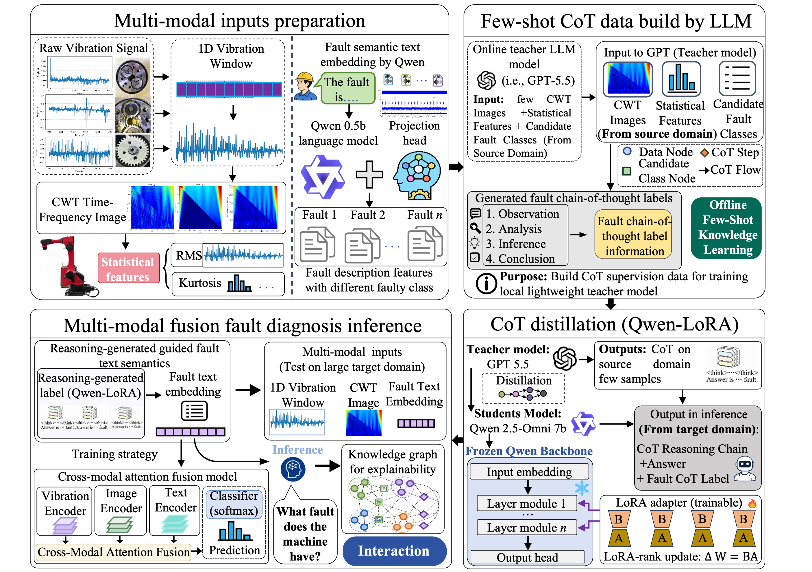
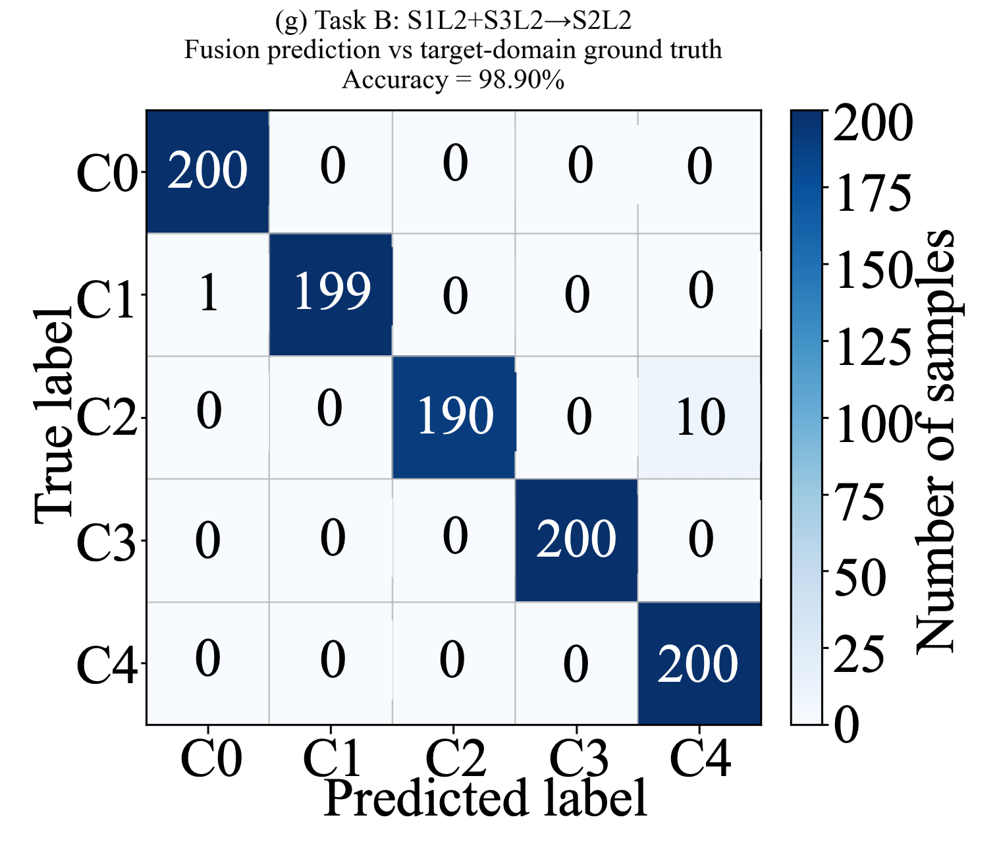
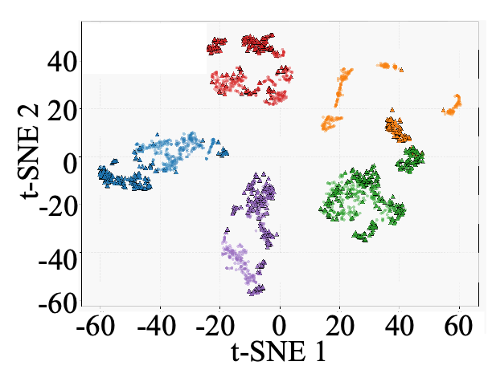
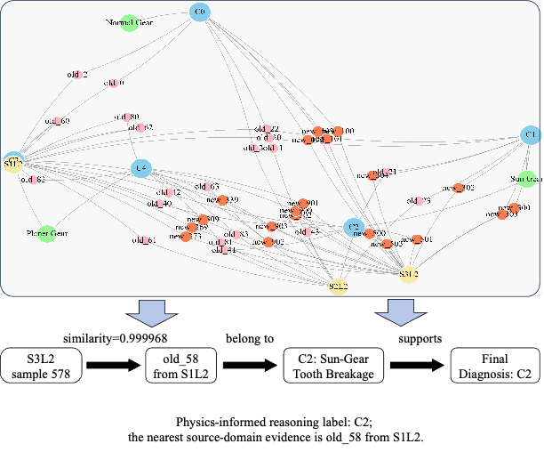

This repository provides the supplementary materials for our paper:

**Few-Shot Large-Model Reasoning-Chain-Guided Multimodal Fusion for Explainable Cross-Condition Fault Diagnosis of Industrial Robots**

The proposed framework, named **FS-LCMF**, integrates few-shot large-model reasoning-chain distillation, reasoning-generated-label-guided multimodal fusion, and dynamic knowledge graph explanation for cross-condition fault diagnosis of industrial robots.

## Overview

The proposed framework, named **FS-LCMF**, integrates few-shot large-model reasoning-chain distillation, reasoning-generated-label-guided multimodal fusion, and dynamic knowledge graph explanation for cross-condition fault diagnosis of industrial robots.

Industrial robots operate under variable speeds and loads, which may lead to significant distribution shifts in vibration signals, time-frequency patterns, and fault semantics. In practical applications, target-condition labels are usually unavailable, while directly invoking online large models for large-scale sample-by-sample inference is computationally expensive.

To address these issues, this work proposes a few-shot reasoning-chain-guided multimodal diagnosis framework. First, a small number of labeled source-condition samples are used to query an online teacher large model and construct diagnostic reasoning-chain supervision data. Then, the teacher-generated reasoning chains are distilled into a local Qwen-LoRA model, which generates reasoning-generated labels for large-scale unseen target-condition samples. Finally, vibration signals, CWT time-frequency images, and fault semantic embeddings are fused for cross-condition diagnosis, while a dynamic knowledge graph provides traceable diagnostic evidence.

## Implementation details
The complete FS-LCMF workflow contains the following stages:
1. Multimodal input preparation
   Raw vibration signals are segmented into fixed-length windows. Each window is transformed into a CWT time-frequency image, and RMS and Kurtosis are calculated as statistical indicators.
2. Few-shot reasoning-chain construction
   A small number of labeled source-condition samples are sent to an online teacher large model together with CWT images, statistical indicators, and candidate fault classes to generate diagnostic reasoning chains.
3. Qwen-LoRA reasoning-chain distillation
   The teacher-generated reasoning chains and class conclusions are used to fine-tune a local Qwen-LoRA model. The backbone parameters are frozen, and only LoRA adapter parameters are updated.
4. Reasoning-generated label inference
   The fine-tuned Qwen-LoRA model is used to infer reasoning chains and reasoning-generated labels for large-scale target-condition samples without using target-domain true labels.
5. Multimodal fusion diagnosis
   Vibration features, CWT image features, and fault semantic embeddings are fused by a cross-modal attention network for fault classification.
6. Dynamic knowledge graph explanation
   Source samples, target samples, fault classes, and semantic knowledge nodes are connected through feature similarity and reasoning-generated labels to provide traceable diagnostic evidence.

## Acknowledgements
This work is conducted for industrial robot fault diagnosis and predictive maintenance research. The authors would like to thank all contributors and collaborators who supported the experimental platform, data acquisition, and algorithm development.


### Confusion matrix

The flowchart of FS-LCMF.



## Results
### Confusion matrix

The confusion matrix shows the classification performance of FS-LCMF under the unseen target condition.



### Boxplots

The Boxplots shows the classification performance of FS-LCMF compare with other scenarios.


### Feature visualization

The t-SNE visualization illustrates the separability of multimodal fusion features under cross-condition diagnosis. Compared with single-modal vibration features, the fused representation shows more compact intra-class distributions and clearer inter-class boundaries.



Updated dynamic knowledge graph:



## Repository Contents

```text

Data/           Partial publicly available sample data. Only normal-condition samples are provided for demonstration.
Results/        Experimental result, including framework, confusion matrices, t-SNE visualization, and knowledge graph visualization.
src/            Source code for preprocessing, reasoning-chain distillation, multimodal fusion, and dynamic knowledge graph construction.

For CUDA 12.1 PyTorch installation, it is recommended to install PyTorch separately:
pip install torch==2.5.1+cu121 torchvision==0.20.1+cu121 torchaudio==2.5.1+cu121 --index-url https://download.pytorch.org/whl/cu121
pip install -r requirements.txt


    
